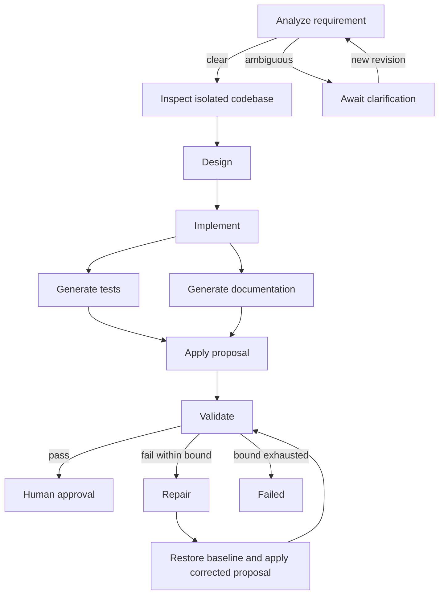

# Architecture

## Boundaries

This is a modular monolith with a separate short-lived Docker process for generated
builds. The scheduler lives in the API process. It is not a distributed worker queue.

| Package | Responsibility |
| --- | --- |
| workflow/api | HTTP DTOs, validation, mapping and problem responses |
| workflow/application | Use cases, scheduling, revision governance and telemetry |
| workflow/domain | Immutable state, dependency graph and transition rules |
| workflow/persistence | SQL transactions, row locking, snapshots and audit records |
| agent | Role-specific request/output contracts, model adapter and output policy |
| agent/client | Model HTTP transport, credentials, deadlines and byte limits |
| execution | Source snapshots, patch installation and isolated build capability |
| config | Dependency wiring and operator configuration |

## Execution graph

The dependency graph is a platform-owned lifecycle template. Analysis determines
whether it can expand; validation failures add repair/apply/validate nodes. The
model describes decomposition within its design output but cannot insert arbitrary
executable task types or remove governance gates.

## State and concurrency

Each state change locks the workflow row, updates its JSON snapshot, and appends an
audit event containing the resulting snapshot in the same transaction. Immutable
task claims carry their workflow revision and attempt number. Completion is accepted
only when that exact task attempt remains active in the current revision.

A fixed executor and semaphore bound concurrent work. Ready branches may run
concurrently; APPLY joins tests and documentation. Database transactions are kept
outside model calls and build processes. Artifact writes use separate revision
directories, so superseded work cannot change a newer revision's files.

The scheduler is supported as one active instance. Do not deploy multiple instances
against the same database: startup recovery assumes prior workers are gone.

## Replanning and recovery

Clarification, requirement revision and recovery increment the revision. All prior
task outputs are invalidated conservatively; historical snapshots remain in audit.
The execution time budget restarts per revision. Completed workflows are immutable;
a subsequent engineering request creates another workflow.

Pure model tasks retry within MAX_ATTEMPTS. Uncertain filesystem/build exceptions
safe-stop immediately. A nonzero build exit is validation evidence and can trigger
repair. Interrupted running tasks safe-stop after application restart; pending work
with no interrupted task may continue. Recovery starts a fresh workspace rather than
replaying an uncertain effect. Safe-stop prevents further orchestration and approval;
an already-running external operation may finish within its configured deadline.

## Artifact integrity

The platform snapshots supported text sources, records a baseline fingerprint,
and applies complete file contents to a staged copy. Installation uses same-filesystem
atomic directory moves with a previous-tree fallback. Repair rebuilds from the
baseline and accumulated corrected proposals. Deletes are unsupported.

Validation records a source fingerprint outside the build mount. Approval rechecks
that fingerprint and requires the current revision and a separate authenticated
approver. COMPLETED means a reviewed local outcome; no Git publishing or deployment
is performed by a workflow.

## Decisions

- Java 17 and Gradle follow the requested stack.
- JDBC makes transaction/row-lock behavior explicit without entity lifecycle machinery.
- PostgreSQL stores control state and audit lineage; application data belongs to generated projects.
- A small graph/state engine keeps execution policy inspectable without a workflow framework.
- Interfaces are limited to genuine external variation: model generation and process execution.
- Local HTTP Basic roles serve the prototype. A production identity provider is a separate adapter increment.
